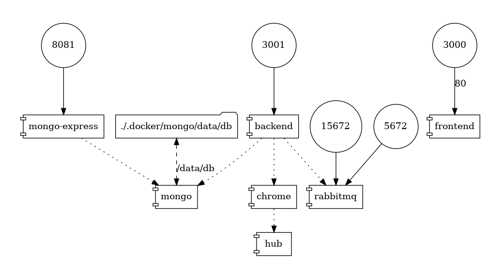

# Google Rank Tracker


This project will help SEO specialist to track their website pages rank in Google search result.

It will use an in memory Chrome browser to search your keyword in Google and find your website rank in the search result page.

## Installation
This is a docker project, so you need to install [Docker](https://docs.docker.com/engine/install) and [Docker Compose](https://docs.docker.com/compose/install) first.

To install and run this project, run these commands:
```
git clone https://github.com/mohsensaremi/google-rank-tracker.git
cd google-rank-tracker
docker-compose up
```
It will take some time to pull images and run the application, so be patient.

After running the application visit [http://localhost:3000](http://localhost:3000) and enter your websites and keywords.

###The application will get and update the pages rank once a day at 00:00.


##Docker Images



The docker-compose file contains the following images:

###[mongo](https://hub.docker.com/_/mongo)

This is the data store.

###[mongo-express](https://hub.docker.com/_/mongo-express)

For monitoring data store.

###[selenium/hub](https://hub.docker.com/r/selenium/hub) and [selenium/node-chrome](https://hub.docker.com/r/selenium/node-chrome)

We are using this image to open a browser, search on google, and find the rank.

###[rabbitmq](https://hub.docker.com/_/rabbitmq)

This is the queue for getting pages rank in order.

###[mohsensaremi/google-rank-tracker-backend](https://github.com/mohsensaremi/google-rank-tracker-backend)

Backend for managing all the work.

###[mohsensaremi/google-rank-tracker-frontend](https://github.com/mohsensaremi/google-rank-tracker-frontend)

The user interface for working with the application.